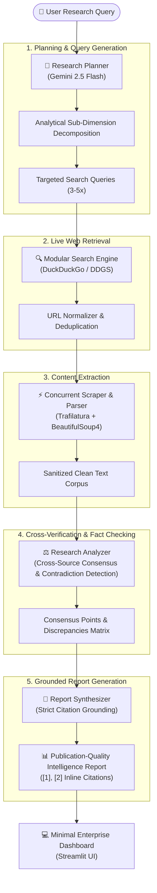

# ResearchAI — Autonomous AI Research Agent

[](https://www.python.org/downloads/)
[](https://streamlit.io/)
[](https://ai.google.dev/)
[](LICENSE)

**ResearchAI** is a production-grade, autonomous AI research engine designed for **Data Analytics, AI/ML engineering, and technical intelligence**. Unlike shallow chatbot wrappers that hallucinate answers or send single prompts to an LLM, ResearchAI implements a deterministic, multi-stage agentic loop that plans search angles, performs live web retrieval, extracts main-body text from source documents, cross-checks facts across sources to detect contradictions, and synthesizes an academic-grade structured report with verified numeric citations (`[1]`, `[2]`).

---

## 🏛️ System Architecture



---

## ✨ Core Features

- **Autonomous Agentic Loop**: Deconstructs questions into analytical sub-topics instead of executing naive one-shot prompts.
- **Live, Zero-Cost Web Retrieval**: Integrated multi-query search using DuckDuckGo (`ddgs`) with automated HTML fallback.
- **Deep Content Extraction**: Concurrently fetches real web pages and parses clean main-body text using `trafilatura` and `beautifulsoup4`, filtering out ads, navigation headers, and boilerplate.
- **Multi-Source Cross-Verification**: Compares evidence across sources, highlights consensus findings, and explicitly flags contradictions and divergent metrics rather than silently picking one.
- **Strict Citation Grounding**: Every factual claim and data point is mapped to verified bracketed citations (`[1]`, `[2]`). Never invents URLs or phantom citations.
- **Interactive Source Inspector**: Expandable source cards displaying domain, URL, extracted facts, word count, and relevance rationale.
- **Real-Time Progress Stepper**: Live UI indicator reflecting backend execution milestones (Plan → Search → Collect → Analyze → Report).
- **Multi-Format Exporting**: One-click download of the completed investigation as a publication-ready Markdown document or a structured JSON payload for data analytics pipelines.
- **Google-Grade Enterprise UI**: Clean, light-mode minimalist dashboard built with custom CSS, high-contrast typography, and full mobile responsiveness.

---

## 📂 Project Structure

```
AI-Research-Agent/
├── app.py                  # Streamlit web application & UI state management
├── agent.py                # ResearchAgent orchestrator and progress streaming
├── config.py               # Centralized configuration, timeouts, and env validation
├── search.py               # Modular web search client (DuckDuckGo + fallbacks)
├── source_processor.py     # Concurrent web scraper and Trafilatura body extractor
├── planner.py              # Research planner and query generation module
├── analyzer.py             # Cross-source fact extractor and contradiction detector
├── report_generator.py     # Citation-grounded structured report synthesizer
├── test_agent.py           # Unit tests and component verification suite
├── requirements.txt        # Production dependency specifications
├── .env.example            # Environment variable configuration template
├── .gitignore              # Git ignore rules protecting secrets and cache
└── utils/
    └── helpers.py          # String sanitization, domain parsing, and export builders
```

---

## 🚀 Quickstart & Local Setup

### 1. Prerequisites
- Python 3.10 or higher
- A Google Gemini API Key ([Get a free key from Google AI Studio](https://aistudio.google.com/app/apikey))

### 2. Clone the Repository
```bash
git clone https://github.com/your-username/AI-Research-Agent.git
cd AI-Research-Agent
```

### 3. Create a Virtual Environment
```bash
python -m venv .venv

# On Windows (PowerShell):
.venv\Scripts\Activate.ps1

# On macOS/Linux:
source .venv/bin/activate
```

### 4. Install Dependencies
```bash
python -m pip install -r requirements.txt
```

### 5. Configure Credentials
Copy `.env.example` to `.env` and insert your Gemini API Key:
```bash
cp .env.example .env
```
Inside `.env`:
```env
GEMINI_API_KEY=AIzaSy...your_api_key_here
GEMINI_MODEL=gemini-2.5-flash
```
*(Alternatively, you can provide your API key securely inside the application sidebar at runtime without persisting it).*

### 6. Launch the Application
```bash
streamlit run app.py
```
Open your browser at `http://localhost:8501`.

---

## 🧪 Running Tests

Run the automated test suite to verify configuration validation, search retrieval, content parsing, and export formatting:

```bash
python -m unittest test_agent.py
```

---

## 🔒 Security & Privacy Engineering

- **Zero Secret Exposure**: `.env` and local credentials are strictly excluded from version control via `.gitignore`.
- **Runtime-Only Credential Memory**: When entered via the UI sidebar, API keys are held strictly in temporary session state and never logged or written to disk.
- **Fail-Safe Error Boundaries**: API errors, rate limits, and network timeouts are caught gracefully and translated into user-friendly error cards without exposing stack traces or API keys.
- **URL & Content Sanitization**: All retrieved web text undergoes character sanitization and control-character stripping before reaching the LLM or UI.

---

## 🌐 Deployment Guide

### Deploy to Streamlit Community Cloud
1. Push your repository to GitHub (ensure `.env` is **not** committed).
2. Go to [share.streamlit.io](https://share.streamlit.io/) and connect your repository.
3. In **Advanced Settings**, add your secret in the **Secrets** section:
   ```toml
   GEMINI_API_KEY = "your_actual_gemini_api_key"
   ```
4. Set Main file path to `app.py` and click **Deploy**.

### Deploy via Docker
```dockerfile
FROM python:3.11-slim
WORKDIR /app
COPY requirements.txt .
RUN pip install --no-cache-dir -r requirements.txt
COPY . .
EXPOSE 8501
CMD ["streamlit", "run", "app.py", "--server.port=8501", "--server.address=0.0.0.0"]
```

---

## 📊 Analytical & Portfolio Highlights

This project demonstrates practical competency across:
1. **Agentic System Design**: Implementing autonomous task decomposition, multi-query search strategies, and multi-stage orchestration without heavy, opaque frameworks.
2. **Information Retrieval & Web Scraping**: Robust scraping pipelines resilient to varying website layouts, rate limits, and network latency.
3. **Data Quality & Cross-Source Verification**: Heuristics and LLM prompts designed to detect consensus and factual divergence across unstructured web text.
4. **Production Software Engineering**: Modular clean architecture, type annotations, dataclasses, centralized configuration, and unit testing.

---

## 📄 License
This project is open-source and licensed under the [MIT License](LICENSE).
