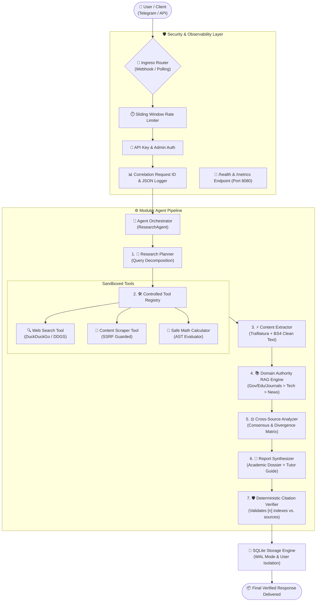

# AI Research Agent — Telegram AI Assistant

[](https://www.python.org/downloads/)
[](Dockerfile)
[](.github/workflows/ci.yml)
[](LICENSE)

An AI-powered multilingual research assistant and Telegram bot engineered for structured information retrieval, source evaluation, evidence cross-checking, and citation verification.

---

## Overview

Unlike standard chat interfaces that rely solely on parametric model knowledge, **AI Research Agent** coordinates a deterministic multi-stage workflow: decomposing complex inquiries into targeted search angles, retrieving live documents, extracting clean body text, evaluating domain authority, identifying consensus and divergences across sources, and generating grounded responses with verifiable inline citations (`[1]`, `[2]`).

The system includes per-user session isolation, audio transcription, multilingual translation with Right-to-Left (RTL) formatting, rate limiting, and an evaluation benchmark suite.

---

## Features

- **Multi-Stage Research Planning**: Analyzes the user's research query and breaks it down into 3–5 targeted search queries across distinct analytical dimensions.
- **Controlled Tool Execution Subsystem**: Sandboxed tools with strict input schemas for web search, web content extraction with SSRF defense, and AST-based safe mathematical evaluation.
- **Domain-Aware RAG Ranking**: Categorizes and weights sources by institutional authority (Government / Academic / Peer-Reviewed Journals > Official Tech Docs / Standards > Reputable News > General References).
- **Cross-Source Evidence Analysis**: Identifies consensus findings across documents and explicitly highlights conflicting data or divergent metrics.
- **Deterministic Citation Verification**: Scans output text to verify that every inline bracketed citation (`[n]`) maps directly to a retrieved source document, automatically removing unsupported reference markers.
- **Multilingual Support**: Native output in **English**, **Hindi (हिन्दी)**, **Telugu (తెలుగు)**, and **Arabic (العربية)** with proper Unicode RTL mark formatting.
- **Pedagogical Topic Tutor ("Understand This Topic")**: Structured explanatory guides featuring core concepts, real-world analogies, and step-by-step breakdowns.
- **Voice Message Processing**: Transcribes Telegram voice notes into text queries using the Gemini Audio API.
- **User Session Isolation**: SQLite WAL-mode database ensures complete separation of conversation history, user preferences, and rate limits between users.
- **Production Telemetry & Observability**: Structured JSON logging with correlation `request_id`, masked user identifiers, and a standalone `/health` HTTP endpoint on port 8080.

---

## Architecture



---

## Tech Stack

| Component | Technology | Purpose |
| :--- | :--- | :--- |
| **Language & Runtime** | Python 3.10+ | Core application logic and orchestration |
| **LLM Provider** | Google Gemini (Gemini 2.5 Flash / Flash fallback) | Planning, reasoning, synthesis, audio processing |
| **Bot Ingress** | `python-telegram-bot` (v21+) | Async Telegram Bot API handling (Webhook & Polling) |
| **Web Retrieval** | `duckduckgo-search` / HTTP fallback | Live internet document search |
| **Content Extraction** | `trafilatura`, `beautifulsoup4`, `httpx` | HTML sanitization and main body text parsing |
| **Database** | SQLite (WAL Mode) | Per-user session isolation, rate limits, history |
| **Security** | Python `ipaddress`, `socket`, `ast` | SSRF defense, AST safe calculator, data masking |
| **Containerization** | Docker (Multi-stage) | Lightweight runtime with unprivileged non-root user |
| **CI/CD** | GitHub Actions | Automated linting, test discovery, and Docker build matrix |

---

## How It Works

1. **Question Deconstruction**: The research planner analyzes the user's inquiry and formulates orthogonal search queries to cover distinct sub-dimensions.
2. **Live Document Retrieval**: Queries are dispatched to live search engines to retrieve candidate URLs and snippets.
3. **SSRF-Protected Content Extraction**: URLs are verified against private and reserved IP ranges (RFC 1918, loopback, cloud metadata) before concurrent fetching and body text extraction.
4. **Domain Authority Scoring & RAG Packaging**: Sources are ranked based on institutional domain authority. Passages are chunked and budgeted into an optimized context prompt.
5. **Cross-Source Analysis**: Identifies areas of consensus across retrieved documents and extracts any conflicting claims or divergent figures.
6. **Report Synthesis**: Produces a structured Markdown dossier and pedagogical explanation in the requested language.
7. **Post-Generation Verification**: A deterministic citation verifier confirms that all bracketed citations (`[1]`, `[2]`) map to actual retrieved sources, scrubbing unsupported reference tags before output.

---

## Telegram Commands

| Command | Description |
| :--- | :--- |
| `/start` | Welcome message, bot overview, and interactive main menu. |
| `/help` | Detailed usage guide, syntax instructions, and feature explanations. |
| `/research <query>` | Triggers full multi-source deep investigation mode. |
| `/quick <query>` | Triggers fast, concise single-pass retrieval mode. |
| `/sources` | Displays detailed metadata and direct links for the most recently cited sources. |
| `/history` | Displays recent research queries and allows one-click report reloading. |
| `/language` | Interactive menu to switch response language (English, Hindi, Telugu, Arabic). |
| `/voice` | Voice query instructions and toggles voice response mode. |
| `/clear` | Purges all conversation history and cached sessions for the current user. |
| `/about` | Displays system architecture details and active model parameters. |
| `/admin` | Displays secure system telemetry, user statistics, and error logs (admin-only). |

---

## Multilingual Support

The agent supports native generation and on-the-fly translation in four languages:

- **English (`en`)**: Default standard technical and academic presentation.
- **Hindi (`hi`)**: Natural Unicode Devanagari script with English technical terms in parentheses where appropriate.
- **Telugu (`te`)**: Natural Unicode Telugu script with technical term preservation.
- **Arabic (`ar`)**: Modern Standard Arabic formatted with Unicode Right-to-Left Marks (`\u200F`) for clean display across Telegram clients.

---

## Security & Reliability

- **Zero Hardcoded Secrets**: All tokens and API keys are loaded via environment variables.
- **SSRF Defense**: The scraper tool validates all target URLs against private networks (`10.0.0.0/8`, `172.16.0.0/12`, `192.168.0.0/16`), loopback (`127.0.0.0/8`, `::1`), and cloud metadata endpoints (`169.254.169.254`).
- **Safe Calculator**: Arithmetic operations are evaluated via Python's `ast` (Abstract Syntax Tree) with strict node whitelisting and exponent bounds, avoiding `eval()` or `exec()`.
- **Sliding-Window Rate Limiting**: Per-user request frequency is tracked in SQLite to prevent resource abuse.
- **Duplicate Update Defense**: In-memory cache prevents reprocessing duplicate Telegram webhook deliveries.
- **User ID Masking**: Telemetry logs mask user identifiers (e.g. `12***89`) to preserve user privacy.

---

## Testing

The project includes a comprehensive unit and integration test suite:

```bash
# Run the complete test suite
python -m unittest discover -p "test_*.py" -v
```

### Test Modules:
- `test_tools.py`: Tool registry schemas, SSRF URL blocking, AST safe math evaluation.
- `test_citation_verifier.py`: Citation parsing, valid source mapping, hallucination scrubbing.
- `test_rag_engine.py`: Domain authority scoring, context budgeting, token estimation.
- `test_observability.py`: JSON log formatting, metrics aggregation, `/health` HTTP endpoint.
- `test_evaluation.py`: Benchmark dataset integrity, Unicode script fidelity, topic recall.
- `test_production_bot.py`: User session isolation, rate limits, duplicate update defense, admin security.
- `test_agent.py`: Agent lifecycle, planner decomposition, translation, source extraction.

---

## Evaluation

The repository includes a dedicated evaluation dataset with **30 representative research questions** spanning Healthcare, Artificial Intelligence, Physics & Clean Energy, Economics & Finance, Global Health, Distributed Computing, and Multilingual topics ([`evaluation/benchmark_dataset.json`](evaluation/benchmark_dataset.json)).

To execute the benchmark harness:

```bash
# Run full benchmark evaluation
python evaluation/run_eval.py --mode deep

# Run a quick sample evaluation (e.g., 5 queries)
python evaluation/run_eval.py --max-samples 5 --mode simple
```

The evaluator measures:
- **Citation Grounding Rate**: Ratio of valid citations mapped to retrieved sources.
- **Domain Authority Score**: Proportion of Tier-1 and Tier-2 sources among retrieved documents.
- **Topic Recall**: Coverage of key domain concepts in the generated response.
- **Script Fidelity**: Verification of appropriate Unicode ranges for non-English outputs.
- **Latency**: Measured execution time per query (p50, p95).

---

## Local Setup

### 1. Prerequisites
- Python 3.10, 3.11, or 3.12
- Google Gemini API Key ([Google AI Studio](https://aistudio.google.com/app/apikey))
- Telegram Bot Token ([BotFather](https://t.me/BotFather))

### 2. Installation
```bash
# Clone the repository
git clone https://github.com/mohammedasim10/AI-Research-Agent.git
cd AI-Research-Agent

# Create and activate a virtual environment
python -m venv .venv
source .venv/bin/activate  # On Windows: .venv\Scripts\activate

# Install dependencies
pip install -r requirements.txt
```

### 3. Environment Configuration
Copy the template file and populate your credentials:
```bash
cp .env.example .env
```

Edit `.env`:
```ini
TELEGRAM_BOT_TOKEN=your_telegram_bot_token_here
GEMINI_API_KEY=your_gemini_api_key_here
GEMINI_MODEL=gemini-2.5-flash
RATE_LIMIT_PER_MINUTE=15
ADMIN_USER_IDS=your_telegram_user_id
```

### 4. Running the Bot
```bash
# Run the Telegram bot service (starts polling and /health server on port 8080)
python bot.py
```

---

## Environment Variables

| Variable | Required | Default | Description |
| :--- | :---: | :---: | :--- |
| `TELEGRAM_BOT_TOKEN` | Yes | — | Bot authentication token from @BotFather |
| `GEMINI_API_KEY` | Yes | — | Google Gemini API key |
| `GEMINI_MODEL` | No | `gemini-2.5-flash` | Primary Gemini model identifier |
| `ADMIN_USER_IDS` | No | — | Comma-separated Telegram user IDs with access to `/admin` |
| `RATE_LIMIT_PER_MINUTE` | No | `15` | Maximum research requests per minute per user |
| `WEBHOOK_URL` | No | — | Base URL for Telegram webhook hosting (leave empty for polling) |
| `WEBHOOK_SECRET_TOKEN` | No | — | Secret token for validating Telegram webhook requests |
| `WEBHOOK_PORT` | No | `8080` | Port for the webhook and `/health` server |
| `SEARCH_TIMEOUT_SECONDS`| No | `10` | Timeout for search engine requests |
| `FETCH_TIMEOUT_SECONDS` | No | `8` | Timeout for web page scraping requests |

---

## 24/7 Live Automation & Deployment

### 1. Local 24/7 Live Supervisor (`watchdog_runner.py`)
Run the bot locally with self-healing, automatic crash recovery, and health probe monitoring:

```bash
# Start the 24/7 self-healing supervisor
python watchdog_runner.py
```
- **Automatic Process Supervision**: If network drops or the process crashes, the watchdog re-initializes `bot.py` within 5 seconds.
- **Continuous Health Probes**: Queries `http://127.0.0.1:8080/health` every 30s. If 3 consecutive probes fail, it cleans up and restarts the process.

---

### 2. Free 24/7 Cloud Hosting (1-Click Deployment)

The repository includes pre-configured **`render.yaml`** and **`Procfile`** for instant zero-lag cloud deployment:

#### Option A: Render (Free Web Service)
1. Push this repo to GitHub.
2. Log into [Render.com](https://render.com) and click **New +** > **Blueprint**.
3. Select this repository (`AI-Research-Agent`).
4. Set the environment variables:
   - `TELEGRAM_BOT_TOKEN`
   - `GEMINI_API_KEY`
5. Click **Apply**. Render will automatically build the service, start the bot, and monitor `/health` 24/7.

#### Option B: Railway / Koyeb / Heroku
1. Create a new service connected to this repository.
2. The platform automatically detects `Procfile` (`web: python bot.py`).
3. Set your `TELEGRAM_BOT_TOKEN` and `GEMINI_API_KEY` in the environment variables tab.

---

### 3. Docker Deployment

Build and run using the multi-stage Docker container:

```bash
# Build the Docker image
docker build -t ai-research-agent:latest .

# Run the container with auto-restart
docker run -d \
  --name ai-research-agent \
  -p 8080:8080 \
  --env-file .env \
  -v $(pwd)/data:/app/data \
  --restart unless-stopped \
  ai-research-agent:latest

# Verify health status
curl http://localhost:8080/health
```

---

### 4. Webhook Hosting
For cloud environments (e.g. Render, Railway, AWS ECS, GCP Cloud Run), set `WEBHOOK_URL=https://yourdomain.com` in your environment configuration. The bot will automatically register the webhook with Telegram on startup using `WEBHOOK_SECRET_TOKEN`.

---

## Project Structure

```
AI-Research-Agent/
├── agent.py                  # Agent orchestrator and progress streaming
├── analyzer.py               # Cross-source consensus and contradiction detector
├── app.py                    # Streamlit web UI & analytics dashboard
├── bot.py                    # Telegram assistant (Dual Webhook/Polling ingress)
├── citation_verifier.py      # Deterministic citation verification subsystem
├── config.py                 # Configuration loader and environment validator
├── database.py               # SQLite WAL-mode persistence & per-user isolation
├── observability.py          # Structured JSON logging, metrics, & /health server
├── planner.py                # Research query decomposition module
├── rag_engine.py             # Domain-authority ranking & RAG context builder
├── report_generator.py       # Multi-language dossier and tutor synthesizer
├── requirements.txt          # Python dependency specifications
├── search.py                 # Web retrieval client with fallbacks
├── source_processor.py       # Concurrent web scraper with SSRF defense
├── voice_handler.py          # Gemini audio transcription & language detector
│
├── tools/                    # Sandboxed Tool Calling Subsystem
│   ├── __init__.py           # Tool registry initializer
│   ├── base.py               # BaseTool, ToolParameter, ToolResult, ToolRegistry
│   ├── calculator.py         # AST safe math & statistics calculator
│   ├── scraper.py            # SSRF-protected web scraper tool
│   └── web_search.py         # Web search tool
│
├── evaluation/               # Benchmark Evaluation Framework
│   ├── __init__.py           # Package exports
│   ├── benchmark_dataset.json# 30 Curated multi-domain research questions
│   ├── evaluator.py          # Benchmark evaluation harness
│   └── run_eval.py           # CLI benchmark runner
│
├── utils/                    # Shared utility helpers
│   ├── __init__.py
│   ├── helpers.py            # Text sanitization, domain classification, RTL markers
│   └── security.py           # SSRF IP validation & user ID masking
│
├── .github/workflows/
│   └── ci.yml                # GitHub Actions automated test & build workflow
├── Dockerfile                # Multi-stage secure Docker container definition
├── .dockerignore             # Container build artifact exclusions
├── .env.example              # Sanitized environment variable template
├── .gitignore                # Git ignore rules protecting secrets and data
└── LICENSE                   # MIT License
```

---

## Limitations

- **Search Engine Rate Limits**: Live web searches rely on public search providers, which may occasionally throttle requests under high burst loads.
- **Paywalled & JavaScript-Heavy Content**: Sites protected by paywalls or requiring client-side JavaScript single-page application rendering may return partial content or snippets.
- **LLM Rate Quotas**: API rate limits apply based on the user's Google AI Studio tier.

---

## Future Improvements

- [ ] Support for vector database backends (e.g. Qdrant, ChromaDB) for persistent multi-session knowledge indexing.
- [ ] Direct integration with academic APIs (arXiv API, PubMed API, Semantic Scholar).
- [ ] PDF and document upload analysis in Telegram chat.
- [ ] Headless browser rendering option (e.g. Playwright) for complex JavaScript-dependent pages.

---

## License

This project is licensed under the MIT License. See [LICENSE](LICENSE) for details.
